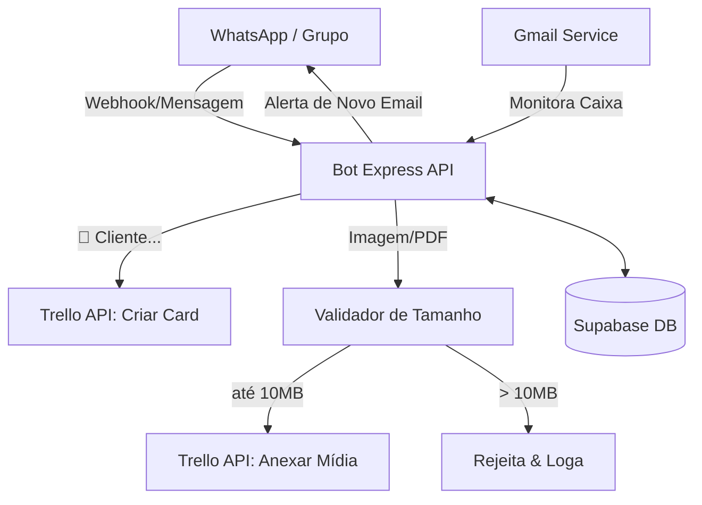

# Bot Trello-WA (v3.0) 🚀

Automação inteligente em NodeJS que integra **WhatsApp** (via Evolution API), **Trello**, **Gmail** e **Supabase** para gerenciamento automático de pedidos, triagem de filas, anexação de mídias e alertas de e-mail em tempo real.

---

## 📋 Arquitetura e Fluxo



---

## ✨ Funcionalidades Principais

1. **Gestão de Sessões via Whatsapp**:
   - Inicializa uma sessão de pedido no Trello de forma contextual por usuário.
   - O comando `👤 Cliente [Nome]` cria um cartão dinamicamente no topo da lista correspondente do Trello.
   - Apenas o criador do pedido (ou remetente do comando) vincula de forma segura as mídias seguintes àquele cartão ativo.
   - O comando `XXX` (ou `xxx`) encerra a sessão ativa do usuário e dispara o organizador de datas.

2. **Ordenação Inteligente e Validação de Datas**:
   - A data de entrega é extraída automaticamente da descrição do texto do pedido (ex: "Entregar em 25/12").
   - Ao encerrar a sessão, o bot ordena a lista do Trello cronologicamente por prazo de entrega (`due date`). Tem proteção nativa contra *Rate Limits* da API do Trello usando técnica de *debounce/retry*.

3. **Anexação automática de Imagens/Documentos**:
   - Detecta e baixa imagens ou documentos (PDFs, Corel, imagens brutas) enviados pelo WhatsApp.
   - Converte os chunks de arquivos diretamente para base64 e realiza o upload para o cartão do Trello correspondente de maneira transparente.

4. **Filtro de Limite e Segurança Anti-Crash**:
   - **Express Payload Limit (50MB)**: O Express barra conexões com payload bruto acima de 50MB retornando `413 Payload Too Large`.
   - **Trello File Limits (10MB)**: O bot valida o cabeçalho `fileLength` do arquivo detectado no WhatsApp *antes* de gastar link de banda e memória RAM baixando a mídia. Se for maior que 10MB, ela é rejeitada. Se por algum motivo o cabeçalho de comprimento estiver ausente, faz uma dupla validação de bytes pós-download na memória da aplicação.

5. **Monitoramento do Gmail**:
   - Varre a caixa postal configurada periodicamente buscando novos e-mails.
   - Notifica grupos específicos do WhatsApp sobre a chegada de novos pedidos via e-mail e previne duplicidade salvando ids de e-mails processados no banco de dados.

6. **Persistência Remota (Supabase)**:
   - Mantém as sessões ativas (`active_sessions`) e as mensagens/e-mails já processados (`processed_messages`/`processed_emails`) em banco relacional PostgreSQL hospedado no Supabase.
   - Evita perda de estados e reprocessamento caso o bot sofra reinicializações em servidores efêmeros (como no Render).

---

## ⚙️ Configuração das Variáveis de Ambiente (`.env`)

Crie um arquivo `.env` na raiz do projeto contendo as seguintes variáveis:

```env
# Servidor do Express
PORT=3000

# Conexão com Evolution API (WhatsApp)
EVOLUTION_API_URL=https://sua-evolution-api-publica.com
EVOLUTION_API_KEY=sua_apikey_aqui
EVOLUTION_INSTANCE_NAME=nome_da_instancia

# Integração Trello
TRELLO_KEY=sua_trello_key_aqui
TRELLO_TOKEN=seu_trello_token_aqui
TRELLO_BOARD_ID=id_do_quadro_do_trello

# Membros Automáticos por Catenização de Tags (Laser/Silk)
MEMBER_LASER=id_do_membro_laser_trello
MEMBER_SILK=id_do_membro_silk_trello

# Configurações de Grupos Monitorados (JSON de correspondência)
# Formato: {"ID_DO_GRUPO_WHATSAPP": {"nomeIdentificador": "NOME", "idListaTrello": "ID_LISTA_TRELLO", "membrosPadrao": ["ID_MEMBROS"]}, ...}
GROUP_CONFIGS_JSON={"120363423653055791@g.us":{"nomeIdentificador":"PEDIDOS ANDRESSA","idListaTrello":"682e37657cb05c0db6e299e7","membrosPadrao":["6474a39ac9b837a8a8f3c0a0"],"idMembroMonitorado":"6474a39ac9b837a8a8f3c0a0"}}

# Monitoramento de Gmail
GMAIL_MONITORED_EMAIL=seu_email_para_monitorar@gmail.com
GMAIL_GROUP_ALERT=id_do_grupo_de_alerta@g.us
GMAIL_CLIENT_ID=seu_client_id_oauth
GMAIL_CLIENT_SECRET=seu_client_secret_oauth
GMAIL_REFRESH_TOKEN=seu_refresh_token_oauth

# Banco de Dados Supabase (PostgreSQL)
SUPABASE_URL=https://seu-projeto.supabase.co
SUPABASE_KEY=sua_supabase_key_anon
```

---

## 🚀 Como Iniciar

### Desenvolvimento Local

1. Instale as dependências:
   ```bash
   npm install
   ```
2. Inicialize o servidor local em modo watch (recarrega automático ao salvar arquivos):
   ```bash
   npm run dev
   ```
3. O servidor abrirá na porta `3000` fornecendo logs limpos no terminal das requisições interceptadas.

### Testes Unitários e Integração
Para executar toda a suíte de testes de estresse, unitários e fluxos mockados no Jest:
```bash
npx jest
```

---

## 📈 Status da API e Limites

Para verificar a saúde, sessões no cache e os limites operacionais configurados no bot, envie uma requisição GET para os endpoints públicos:

* **Health Check**: `GET /health`
* **Status do Sistema**: `GET /status`

### Exemplo de Resposta de Status:
```json
{
  "groups": ["120363423653055791@g.us"],
  "activeSessions": ["558388888888@s.whatsapp.net"],
  "cacheSize": {
    "messages": 234
  },
  "limits": {
    "maxFileSizeTrello": "10MB",
    "maxPayloadExpress": "50MB"
  }
}
```

---

## ☁️ Instruções de Deploy (Render)

Como o bot utiliza escuta por **Webhooks** da Evolution API, ele deve ser implantado como um **Web Service** público capaz de aceitar conexões vindas da internet.

1. Init o repositório Git localmente e envie para o seu painel GitHub:
   ```bash
   git init
   git add .
   git commit -m "feat: setup para deploy"
   git branch -M main
   git remote add origin git@github.com:Abraao-CodeSmith/botTrelloZap.git
   git push -u origin main
   ```
2. Crie um **Web Service** no Render, selecionando o repositório criado.
3. Configure as variáveis ambientais sob o painel de **Environment** no Render de acordo com as especificadas no arquivo `.env`.
4. O Render provê automaticamente a variável `RENDER_EXTERNAL_URL`. A Evolution API utilizará de forma dinâmica essa URL para registrar os webhooks de `MESSAGES_UPSERT` de forma transparente.

*Nota: Garanta que a Evolution API correspondente também não esteja rodando em localhost de rede local externa ao Render (ela deve estar em uma VPS ou serviço equivalente acessível pela nuvem).*
